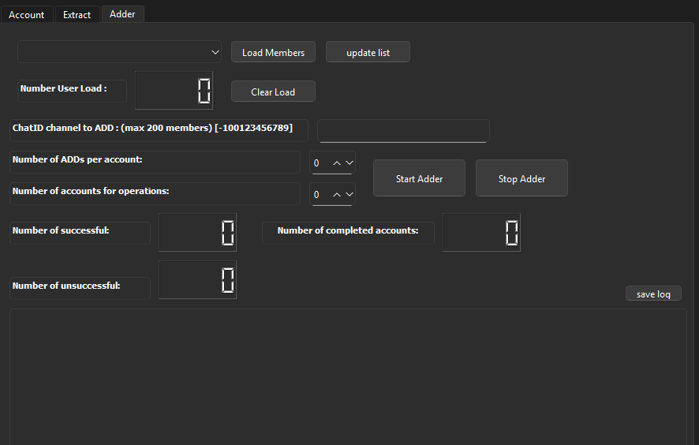

# Telegram Member Adder
This tool can add members from your target Telegram channel/group to your destination Telegram channel (upto 200 members due to Telegram limits)

---

## ✨ Features
- Accounts login & management
- Add members to the channel by username
- Scrape from groups & channels
- Live status & logs UI

## 🚀 How to Use
```bash
pip install -r requirements.txt
python main.py
```

## 📦 Requirements
- Python 3.10+
- Windows 10/11 — Linux/Mac

## 📸 Preview 

⚠️ *Important Disclaimer*
This project are for **educational, research, and administrative purposes only**.  
It *does not* provide or encourage any method to bypass Telegram privacy settings or access hidden data.  
Any misuse that violates Telegram’s *Terms of Service* or local laws is strictly prohibited.  

Always use anonymized/test datasets or data you have *explicit consent* to process.
